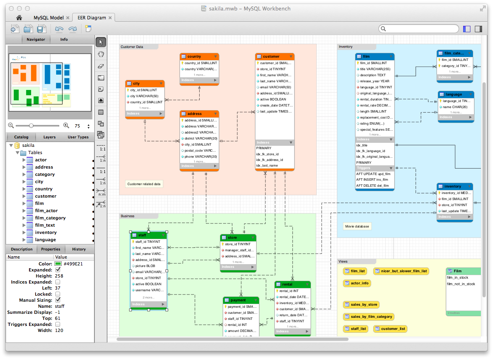

# 01.データ構造

## はじめに

データ構造を理解するとは、データの各カラムがどのように記録されているのか、各カラムの関係性を理解することです。ここでは、データを理解する方法、データの種類、リレーショナルデータベース、基本的なSQLを理解することを目的としています。ここでのデータとは、行志向のデータベースのテーブルを指します。列志向のデータベースのことではありません。

### 1.1 データを構成する要素

例えばこのような会員マスタがあったとします。このテーブル\(一般的にいわれる表のデータのこと\)を表現する際に、行のことはロー\(Row\)、列のことはカラム\(Colmun\)と呼びます。データ分析の世界では、ローとカラムは使い分けられているので、使い分けてください。例えば、`gender`カラムは、4行目ではなく4列目です。`Sato`は3行目の2列目の要素です。

| cu\_id | lastname | birthday | gender | area | rank |
| :--- | :--- | :--- | :--- | :--- | :--- |
| X001 | Tanaka | 2000-01-05 | 男性 | 大阪 | S |
| X002 | Suzuki | null | 女性 | 京都 | C |
| X003 | Sato | 2002-08-03 | null | 奈良 | B |
| X004 | Nakata | 1989-09-26 | 女性 | 東京 | A |
| X005 | Kanda | 1983-10-21 | 男性 | 北海道 | null |

つまり、テーブルは要素1つ1つの集まりであって、要素を列方向で分類しているのが「カラム」であり、行方向に要素を束ねたものが「ロー」です。また、カラムには、その列に格納できるデータの「型」を決めるデータ型が設定されます。このカラムは文字列のみを格納でき、このカラムは数字だけを格納できるというものです。データ型については、Tableauで利用できるデータ型をのちほど紹介します。

### 1.2 データを理解する

次は、テーブルそのものを理解しましょう。可視化、集計するもととなるテーブルが、そもそも何なのか、どのような情報を持っているのかを調べることです。

例えば、下記のよう果物屋のECサイトの注文履歴データがあったとします。テーブルのサイズの確認、カラムの意味、テーブルの粒度を調べてみましょう。

| id | cu\_id | ord\_dt | ord\_id | ord\_detail | ord\_no | fruit\_id | fruit | price | unit | subtotal |
| :--- | :--- | :--- | :--- | :--- | :--- | :--- | :--- | :--- | :--- | :--- |
| 1 | X001 | 2018-12-01 | ord-01 | ord-01-01 | 1 | p001 | リンゴ | 100 | 1 | 100 |
| 2 | X001 | 2019-04-01 | ord-02 | ord-02-02 | 1 | p002 | ミカン | 100 | 2 | 200 |
| 3 | **X002** | **2018-12-10** | **ord-03** | **ord-03-01** | **1** | **p001** | リンゴ | 100 | 1 | 400 |
| 4 | **X002** | **2018-12-10** | **ord-03** | **ord-03-02** | **2** | **p002** | ミカン | 100 | 3 | 400 |
| 5 | X002 | 2019-01-04 | ord-04 | ord-04-01 | 1 | p005 | モモ | 300 | 1 | 300 |
| 6 | X003 | 2019-01-04 | ord-05 | ord-05-01 | 1 | p001 | リンゴ | 100 | 2 | 200 |
| 7 | **X003** | **2019-02-07** | **ord-06** | **ord-06-01** | 1 | p003 | バナナ | 150 | 3 | 850 |
| 8 | **X003** | **2019-02-07** | **ord-07** | **ord-07-01** | 1 | p001 | リンゴ | 100 | 4 | 850 |
| 9 | X004 | 2019-04-01 | ord-08 | ord-08-01 | 1 | p004 | ブドウ | 250 | 2 | 500 |
| 10 | X005 | 2019-02-25 | ord-09 | ord-09-01 | 1 | p001 | リンゴ | 100 | 2 | 200 |

#### 1.2.1データのサイズ

はじめにテーブルのサイズを確認します。このテーブルのサイズは10行×11列のデータです。または10レコード、11カラムのテーブルです。テーブルのサイズを知っておくことは、集計や可視化が正しく行われいるかを確認する上で役立ちます。

#### 1.2.2 カラムの意味

次にカラムの意味を確認していきましょう。データベースの設計者でなければわからないこともあるので、そのようなカラムは設計者に定義を確認します。もしくはテーブル定義書を参考にします。

* `id`：レコード順で、連番が振られている数字です。
* `cu_id`：4桁の会員IDで5人の会員がいる。
* `ord_dt`：注文日で、日付は入っているが時間は記録されていない。
* `ord_id`：注文を識別するIDで、1つの注文をまとめる単位になっている。
* `ord_detail`：1つの注文を束ねるID。
* `ord_no`：1つの注文に対する詳細の注文番号を表すID。
* `fruit_id`：商品のIDで、果物を識別するID。
* `fruit_name`：商品の名前。
* `price`：商品の単価。
* `unit`：商品の個数。
* `subtotal`：1つの注文に対する合計金額。

次はカラムとカラムの関係性について、考えていきます。

例えば、3、4行目に注目すると、`X002`は`2018-12-10`に2回買っているのではなく、1回の注文で2商品買っていることがわかります。`ord_id`と`ord_no`の関係性を考えればわかります。

一方で、7、8行目に注目すると、`X003`は`2019-02-27`に、1回の注文を2回していることがわかります。これは、`ord_id`や`ord_detail`の関係性を考えればわかります。

`subtotal`に注目すると、1つの注文\(`ord_id`\)に対する合計金額が記録されているので、このカラムを使って合計金額をカウントすると、1つの注文\(`ord_id`\)で複数行をもつレコードの数分、金額が重複して合計されてしますので、**誤った集計**になります。

このECサイトの注文履歴データから下記のようなことが、集計できることがわかります。また、会員の属性情報を紐付ければ、属性ごとの集計も可能です。

* 何人の会員が注文しているのか。
* どの果物が何個売れているのか。
* 果物の合計金額はいくらか。
* 会員はいつ注文をして、何回購入しているのか。　etc...

#### 1.2.3 テーブルの粒度

テーブルの粒度とは、**データを一意\(Unique\)に特定するためのカラムの組み合わせ**のことです。言い換えれば、このカラムを使えば、1行を特定できるということです。今回の例だと、`id`がレコードごとに振られているので、このカラムを使えばレコードを一意に特定できます。つまり、`8`と言われたときに、どのレコードを指しているのかがわかります。また、`ord_detail`も、どの番号を指定されてもレコードを特定できます。

例えば、`cu_id`はどうでしょうか。`X001`と言われても、1行目か2行目のいずれのレコードなのか特定できません。**データを一意\(Unique\)に特定できるということは、そのカラムの組み合わせのレコード数をカウントすれば、必ずカウント数は1になります。**

例えば、`ord_detail`ごと\(単位\)にカウントすると、`ord-01-01`から`ord-09-01`まで、どの項目もカウント数は1になりますが、`cu_id`ごとにレコード数をカウントすると、`X001`のカウント数は2、`X002`のカウント数は3、`X003`のカウント数は3、`X004`のカウント数は1、`X005`のカウント数は1になり、カウント数が1になりません。このようなカラムは一意に特定できるカラムではありません。

また、今回のようなサンプルデータのように必ずしも、レコードを特定できるカラムがあるわけではありません。下記のように`id`や`ord_detail`がない場合はどうでしょうか。

この場合、`ord_id`と`ord_no`を組み合わせることで、レコードを一意に特定できます。最終的に、その解釈で問題ないかどうかは、データベースの設計者に確認します。または、テーブル定義書を確認します。

| cu\_id | ord\_dt | ord\_id | ord\_no | fruit\_id | fruit | price | unit | subtotal |
| :--- | :--- | :--- | :--- | :--- | :--- | :--- | :--- | :--- |
| X001 | 2018-12-01 | ord-01 | 1 | p001 | リンゴ | 100 | 1 | 100 |
| X001 | 2019-04-01 | ord-02 | 1 | p002 | ミカン | 100 | 2 | 200 |
| X002 | 2018-12-10 | ord-03 | 1 | p001 | リンゴ | 100 | 1 | 400 |
| X002 | 2018-12-10 | ord-03 | 2 | p002 | ミカン | 100 | 3 | 400 |
| X002 | 2019-01-04 | ord-04 | 1 | p005 | モモ | 300 | 1 | 300 |
| X003 | 2019-01-04 | ord-05 | 1 | p001 | リンゴ | 100 | 2 | 200 |
| X003 | 2019-02-07 | ord-06 | 1 | p003 | バナナ | 150 | 3 | 850 |
| X003 | 2019-02-07 | ord-07 | 1 | p001 | リンゴ | 100 | 4 | 850 |
| X004 | 2019-04-01 | ord-08 | 1 | p004 | ブドウ | 250 | 2 | 500 |
| X005 | 2019-02-25 | ord-09 | 1 | p001 | リンゴ | 100 | 2 | 200 |

大抵は、データベースの設計者がレコードを特定できるように、データベースは設計されますが、そうではない欠陥のあるデータベースがあることも事実です。

### 1.3 データの種類

世の中のデータベースのテーブルの種類をわけると、**「履歴テーブル」と「マスタテーブル」**にわけられます。

違いは色々とありますが、常に最新の更新済みデータが反映されているのがマスタデータで、履歴として記録を残しておくテーブルが履歴\(トランザクション\)テーブルです。ECサイトの履歴テーブルであれば、いつ、誰が、何を、何個注文し、単価はいくら、などの情報を時系列に記録しています。

下記は「会員マスタ」のサンプルです。常に最新の更新済みデータが反映されているのがマスタテーブルです。過去の情報を記録させるために行を増やすのではなく、カラムを増やすことで対応する場合もあります。

| cu\_id | lastname | birthday | gender | area | rank |
| :--- | :--- | :--- | :--- | :--- | :--- |
| X001 | Tanaka | 2000-01-05 | 男性 | 大阪 | S |
| X002 | Suzuki | null | 女性 | 京都 | C |
| X003 | Sato | 2002-08-03 | null | 奈良 | B |
| X004 | Nakata | 1989-09-26 | 女性 | 東京 | A |
| X005 | Kanda | 1983-10-21 | 男性 | 北海道 | null |

大抵、会員マスタであれば、会員IDやユーザーIDと呼ばれるIDで一意に識別できますし、商品マスタであれば、商品IDやプロダクトIDと呼ばれるIDで一意に識別できまが、必ずしもマスタテーブルだからといって、1つのカラムでユニークになるとは必ずしもいいきれません。データベースの設計者に確認しましょう。

そもそもデータベースの設計が誤っている場合は、会員IDや商品IDが重複している場合もあります。テーブルのサイズの確認、カラムの意味、テーブルの粒度を調べることは、どんなデータでも大切です。

下記は「商品マスタ」のサンプルです。マスタテーブルを履歴テーブルに紐付けることで、分析を豊かにします。

| fruit\_id | fruit\_name | fruit\_detail | origin |
| :--- | :--- | :--- | :--- |
| p001 | リンゴ | ふじ | 青森 |
| p002 | ミカン | 愛媛みかん | 愛媛 |
| p003 | バナナ | モンキーバナナ | フィリピン |
| p004 | ブドウ | 巨峰 | 山梨 |
| p005 | モモ | 白鳳 | 山梨 |

### 1.4 リレーショナルデータベース

リレーショナルデータベースとは、さきほどまで説明していたテーブルとテーブルを関係づけて、管理するデータベースのことです。リレーショナルデータベースはテーブルを基本にしており、テーブルとテーブルの関係性\(リレーション\)をもとにデータをかんりするため、リレーショナルデータベースと言われます。

リレーションを考える上で重要なのが「キー」です。「キー」とは、ECサイトの履歴テーブルであれば会員IDや商品IDなどがキーになります。そのキーを使えば、会員マスタの会員IDと紐付けて、履歴テーブルに会員マスタの情報を紐付けることができます。また、商品マスタの商品IDと紐付ければ、履歴テーブルに商品マスタの情報を紐付けることができます。

下記は、履歴テーブルに対して、`cu_id`をキーに会員マスタを結合\(JOIN\)したイメージです。

| cu\_id | ord\_dt | … | price | lastname | birthday | gender | area | rank |
| :--- | :--- | :--- | :--- | :--- | :--- | :--- | :--- | :--- |
| X001 | 2018-12-01 | … | 100 | Tanaka | 2000-01-05 | 男性 | 大阪 | S |
| X001 | 2019-04-01 | … | 100 | Tanaka | 2000-01-05 | 男性 | 大阪 | S |
| X002 | 2018-12-10 | … | 100 | Suzuki | null | 女性 | 京都 | C |
| X002 | 2018-12-10 | … | 100 | Suzuki | null | 女性 | 京都 | C |
| X002 | 2019-01-04 | … | 300 | Suzuki | null | 女性 | 京都 | C |
| X003 | 2019-01-04 | … | 100 | Sato | 2002-08-03 | null | 奈良 | B |
| X003 | 2019-02-07 | … | 150 | Sato | 2002-08-03 | null | 奈良 | B |
| X003 | 2019-02-07 | … | 100 | Sato | 2002-08-03 | null | 奈良 | B |
| X004 | 2019-04-01 | … | 250 | Nakata | 1989-09-26 | 女性 | 東京 | A |
| X005 | 2019-02-25 | … | 100 | Kanda | 1983-10-21 | 男性 | 北海道 | null |

このようにテーブル同士をキーをもとに結合していくことで、テーブルに情報を付与していき、データを管理する特徴を持っているのがリレーショナルデータベースです。実際には下記の画像のように、複数のテーブルがリレーションを持っていることが普通です。

この図は、ER図と呼ばれるもので、テーブルとテーブルのリレーションの関係性を表しているものです。

Source \| [MySQL Workbench: ビジュアルデータベース設計](https://www.mysql.com/common/images/products/MySQL_Workbench_Visual_Design_Mac.png)

Tabelauを始めとするBIツールが扱うのは、基本的にはこのテーブル構造をもつデータです。そのため、**データ構造がどうなっているのか、データ構造を自分がどうのように変形させたのか**を理解することが、集計や可視化をする上で重要になります。

データ構造を変形させるというは、データベースを管理、運用するエンジニアからすると奇妙な表現かもしれませんが、データ分析では、集計や可視化するために、データの構造を変形させることがよくあります。そうすることで、データの集計や可視化をより柔軟に行うことが可能になります。

### 

