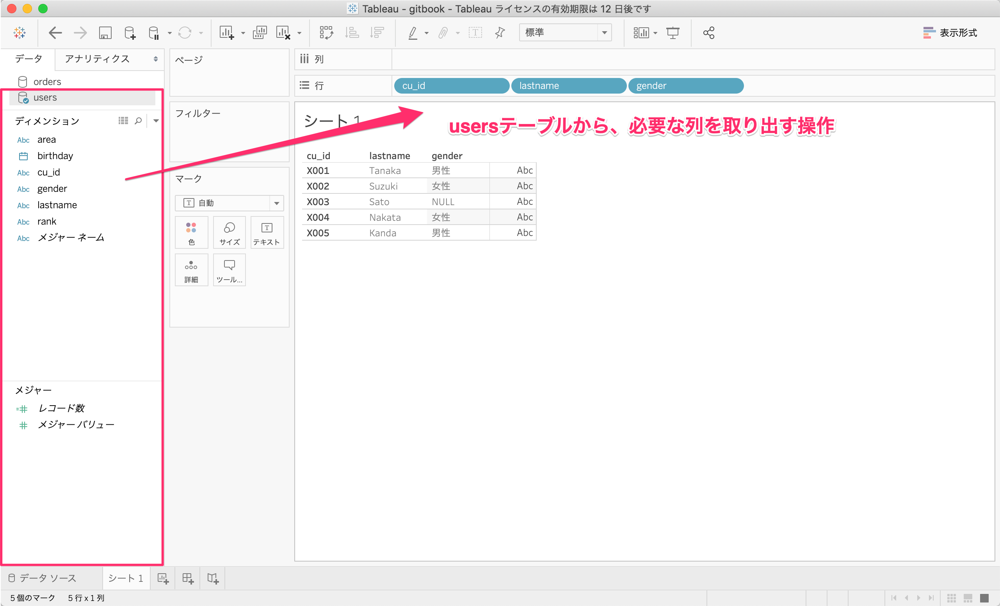
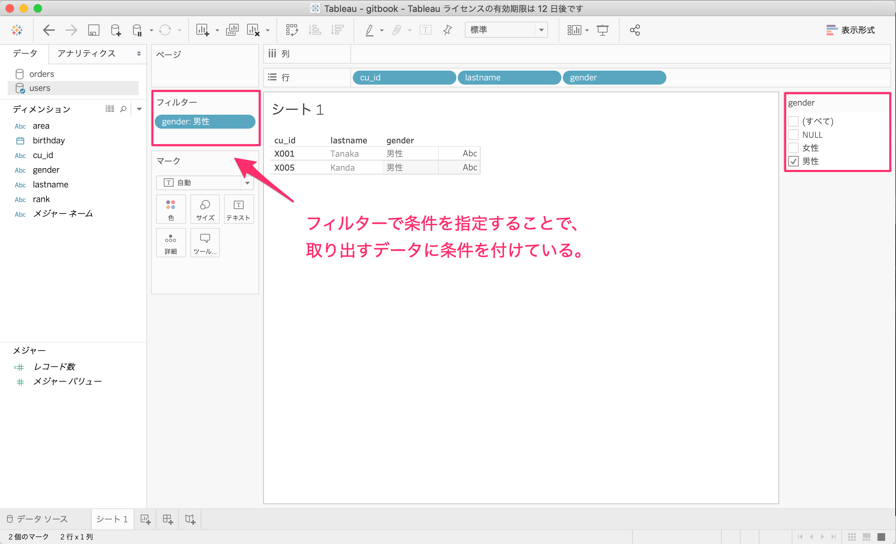
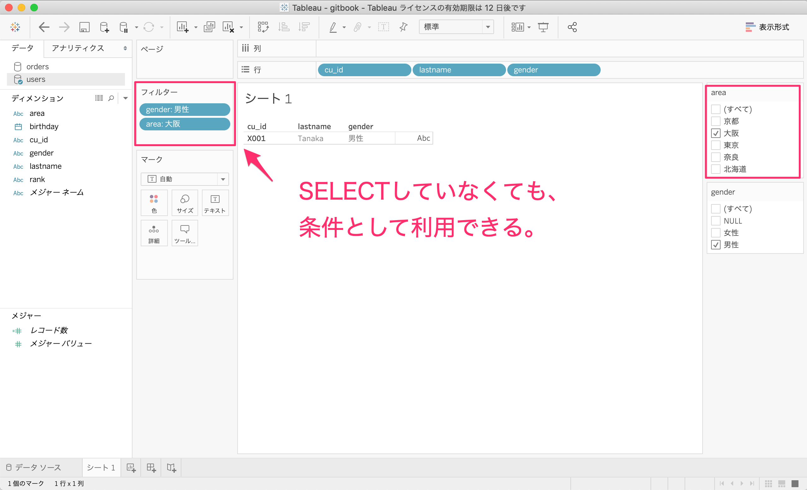
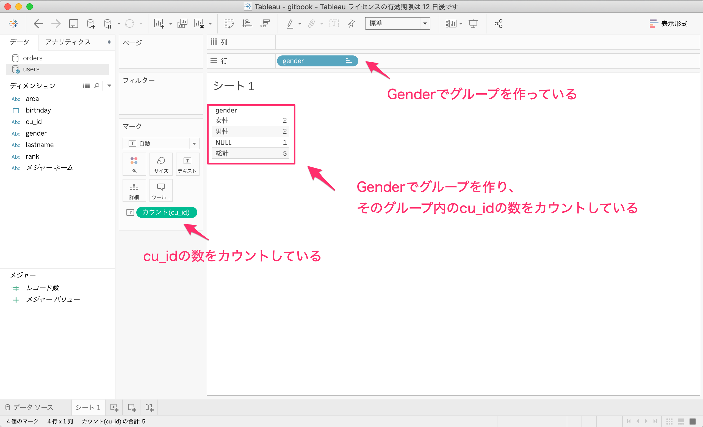

# 02.Tableauのデータ型と関数

## はじめに

ここでは、Tableauで使用できる主なデータ型と関数を説明します。Tableauの関数の使い方を理解することに比例して、データから抽出できる情報量が増えるので、それに伴い分析の幅も広がります。また、データ型に応じて、使える関数が異なります。関連して、Tableauのディメンジョンとメジャーについても説明します。

### 2.1 テーブルを操作するということ

可視化、集計するということは、テーブルを操作することで、データの構造を変形させることです。つまり、自分がどのようにテーブルを変形させるのかを意識することは、Tableauで可視化、集計をする上で非常に大切です。

ここでは、まずSQL\(Structured Query Language\)を使いながら、自分が行った操作が、裏側のデータ構造をどのように変化させるかを考えます。SQLはリレーショナル型データベースを操作するために標準言語です。本書は、データ分析ができるようになることが目的なので、管理や運用に必要なSQL\(`CREATE TABLE`や`INSERT`などなど\)は扱いません。

やっぱりSQLを書かないとダメなのか…と落ち込まないでください。**実際にTableauを利用する際には、SQLを書く必要はありません。**しかし、Tableauで行ったドラック＆ドロップという操作は、裏側ではTableauがSQLに翻訳し、テーブルにアクセスし、データを操作しています。

#### 2.1.1 テーブルから列を取り出すという操作

テーブルからデータを取り出すときはSELECT文の中で、SELECT句とFROM句を使用します。SQLでは下記のように記述します。SELECT句には、取り出したいカラム名を記載し、FROM句には、どのテーブルから取り出すのかを記載します。

```text
SELECT 
    カラム名, 
    ...,
    カラム名
FROM
    テーブル名;
```

「01. データ構造」で取り上げた会員マスタを例に考えます。この会員マスタのテーブル名は`users`です。

| cu\_id | lastname | birthday | gender | area | rank |
| :--- | :--- | :--- | :--- | :--- | :--- |
| X001 | Tanaka | 2000-01-05 | 男性 | 大阪 | S |
| X002 | Suzuki | null | 女性 | 京都 | C |
| X003 | Sato | 2002-08-03 | null | 奈良 | B |
| X004 | Nakata | 1989-09-26 | 女性 | 東京 | A |
| X005 | Kanda | 1983-10-21 | 男性 | 北海道 | null |

`users`から`cu_id`と`lastname`、`gender`を取り出すSQLを書きます。

```text
SELECT
    cu_id,
    lastname,
    gender
FROM
    users;
```

このSQLを書くことで、データの構造をどのように変化させたのか考えます。答えは、下記のようにデータ構造を変化させました。つまり、必要な列だけ取り出すという操作を行い、テーブルから必要なカラムを取り出すようにデータ構造を変形させました。もとのusersテーブルが上書きされるということではありません。

| cu\_id | lastname | gender |
| :--- | :--- | :--- |
| X001 | Tanaka | 男性 |
| X002 | Suzuki | 女性 |
| X003 | Sato | null |
| X004 | Nakata | 女性 |
| X005 | Kanda | 男性 |

Tableauで同じことをするためには、下記のように左側のディメンションにある`users`テーブルから`cu_id`と`lastname`、`gender`をドラック＆ドロップします。ドラック＆ドロップすることでTableauの裏側でテーブルにアクセスするSQLが生成され、データが取り出されます。



#### 2.1.2 テーブルから特定の行を取り出すという操作

先ほどのテーブルに対する操作では、すべての行が出力されていました。不要な行は除外するためには、`WHERE`句を利用します。例えば男性だけで良いのであれば、先ほどのSQL文に`WHERE`句を追加して、条件を指定します。

```text
SELECT
    cu_id,
    lastname,
    gender
FROM
    users
WHERE
    gender = "男性";
```

このようなSQLを書くことで、下記のようにテーブルの構造が再度、変形します。

| cu\_id | lastname | gender |
| :--- | :--- | :--- |
| X001 | Tanaka | 男性 |
| X005 | Kanda | 男性 |

Tableauで同じことをするためには、下記のように左側のディメンションにある`users`テーブルから`cu_id`と`lastname`、`gender`をドラック＆ドロップします。そして、フィルターに`gender`をドラック＆ドロップし、右側のチェックボックスで男性を選択します。



`SELECT`句に記載しなくても、条件付けることはできます。`area`が大阪だけに条件づけます。

```text
SELECT
    cu_id,
    lastname,
    gender
FROM
    users
WHERE
    gender = "男性" AND 
    area = "大阪";
```

Tableauも同様です。フィルターに`area`をドラック＆ドロップし、右側のチェックボックスで大阪を選択します。



あなたがTableauでドラック＆ドロップしている操作の裏側では、このようにデータ構造を変形させ、それをTableauは表示していることになります。集計の仕方がわからないというのは、裏側のデータ構造への理解ができていないので、どのようなデータ構造であれば、思い通りにTableauに表示させることができるのか、まずはそこを考えます。

#### 2.1.3 テーブルを集約するという操作

**Tableauは、取り出したカラムをもとにグループを作り、値を集約して表示します。これがTableauの基本動作です。**説明するよりも見たほうが早いので、今回はTableauで先に実行してみます。値を集約するためには集約関数というものが用意されています。**集約関数は「グループごとに複数行を1行」にまとめます。**

* `COUNT`：指定した文字列カラムのレコード数をカウントする。
* `SUM`：指定した数値型のカラムの値を合計する。
* `AVG`：指定した数値型のカラムの値を平均する。
* `MAX`：指定した数値型のカラムの値の最大値を取得する。
* `MIN`：指定した数値型のカラムの値の最小値を取得する。

とりあえず、Tableauでテーブルを集約するということをやってみましょう。`gender`ごとに`cu_id`の数をカウントして集約します。

`users`は5行あったはずですが、`gender`と`cu_id`を取り出して、`cu_id`の数をカウントすると、男性、女性、NULLの3行しかありません。これは、Tableauというソフトがそのように作られており、取り出したカラムでグループを作り、値を集計する、というのがTableauの基本動作です。



では裏側のテーブルがどうなっているか考えましょう。SQLはこうなります。`GROUP BY`句で集計する単位とするカラムを選択します。基本的にはTableauでは、行や列にカラムを入れることは`GROUP BY`句に値をいれていることになります。

```text
SELECT
    gender,
    count(cu_id)
FROM
    users
GROUP BY 
    gender;
```

つまり、`users`テーブルを変形させ、表示させるテーブル下記のようにしたのです。

| gender | count\(cu\_id\) |
| :--- | :--- |
| 女性 | 2 |
| 男性 | 2 |
| NULL | 1 |

この結果を得た過程を確認します。もとの`users`テーブルは下記のとおりです。

| cu\_id | lastname | gender |
| :--- | :--- | :--- |
| X001 | Tanaka | 男性 |
| X002 | Suzuki | 女性 |
| X003 | Sato | null |
| X004 | Nakata | 女性 |
| X005 | Kanda | 男性 |

ここから、`gender`と`cu_id`を取り出し、`GROUP BY`句で`gender`を指定しました。そうすると、テーブルはこのように変形します。

| gender | cu\_id |
| :--- | :--- |
| 女性 | X002 |
| 女性 | X004 |
| 男性 | X001 |
| 男性 | X005 |
| null | X003 |

さらに、`cu_id`をカウントするために`COUNT`関数を利用しているので、女性というグループ単位で`cu_id`をカウントし、男性というグループ単位で`cu_id`をカウントし、nullというグループ単位で`cu_id`をカウントすることになります。その結果として、先ほどのテーブルが表示され、Tableauもそのようなデータ構造のテーブルを表示することになります。

| gender | count\(cu\_id\) |
| :--- | :--- |
| 女性 | 2 |
| 男性 | 2 |
| NULL | 1 |

これがテーブルを集約するという基本的なデータ構造の変形です。

### 2.2 データ型

### 2.3 ディメンジョンとメジャー

### 2.4 関数一覧

### 2.5 参考サイト

* [Tableau 関数 \(アルファベット順\)](https://help.tableau.com/current/pro/desktop/ja-jp/functions_all_alphabetical.htm)


